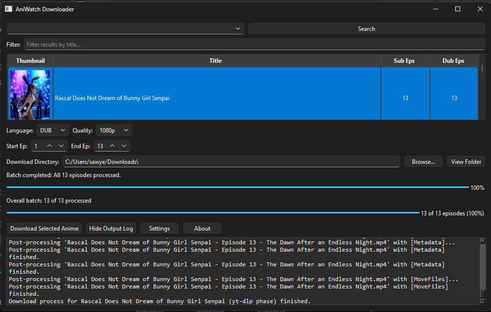

<p align="center">
  
</p>

## AniWatchDownloader

A GUI application to search and download anime from AniWatch.

This project is a desktop application designed to make it easy to find and download your favorite anime from the AniWatch website. It features a simple graphical user interface to search for titles, browse episodes, and manage downloads.

### Key Features
* **Search Functionality:** Find anime by title directly from the application.
* **GUI Interface:** User-friendly interface built with PyQt6.
* **Dependency Management:** Seamlessly handles external download libraries like yt-dlp.
* **Customizable Downloads:** Specify resolution and language for your downloads.
* **Reliable Downloads:** Automatic mirror fallback (HD-1 to HD-3) with delays to avoid bot detection, and support for sequential episode downloads.

***

### Installation

You can set up and run this project using either **Poetry** (recommended) or a standard **`requirements.txt`** file.

#### Option 1: Using Poetry (Recommended)

1.  **Clone the repository:**
    ```bash
    git clone https://github.com/SawyerTheNerd/AniWatchDownloader.git
    cd AniWatchDownloader
    ```

2.  **Install dependencies:**
    This command will read the `pyproject.toml` file and install all necessary packages.
    ```bash
    poetry install
    ```

3.  **Run the application:**
    ```bash
    poetry run python main.pyw
    ```

#### Option 2: Using `requirements.txt`

1.  **Clone the repository:**
    ```bash
    git clone https://github.com/SawyerTheNerd/AniWatchDownloader.git
    cd AniWatchDownloader
    ```

2.  **Create a virtual environment:**
    ```bash
    python -m venv venv
    ```

3.  **Activate the virtual environment:**
    * On Windows: `venv\Scripts\activate`
    * On macOS/Linux: `source venv/bin/activate`

4.  **Install dependencies:**
    ```bash
    pip install -r requirements.txt
    ```

5.  **Run the application:**
    ```bash
    python main.pyw
    ```

***

### Building an Executable

You can package this application into a single executable file for easy distribution using **PyInstaller**.

#### Build Command

```bash
pyinstaller --onefile --windowed --name "AniWatchDownloader" --add-data "yt_dlp_plugins;yt_dlp_plugins" main.pyw
```

**Important:** The `--add-data "yt_dlp_plugins;yt_dlp_plugins"` flag is required to include the custom yt-dlp extractor plugin.

#### Output

- **Location:** `dist/AniWatchDownloader.exe`
- **Size:** ~58 MB
- **Type:** Standalone executable (no Python installation required)

#### Notes

- Windows Defender may show a warning for unsigned executables (this is normal for self-built apps)
- The executable includes all dependencies: PyQt6, yt-dlp, requests, etc.
- FFmpeg is NOT included - install separately for subtitle embedding support

***

### Dependencies
* `requests`
* `pip-system-certs`
* `yt-dlp`
* `pyqt6`
* `yt-dlp-hianime`

***

### License

This project is licensed under the MIT License. See the `LICENSE` file for details.
